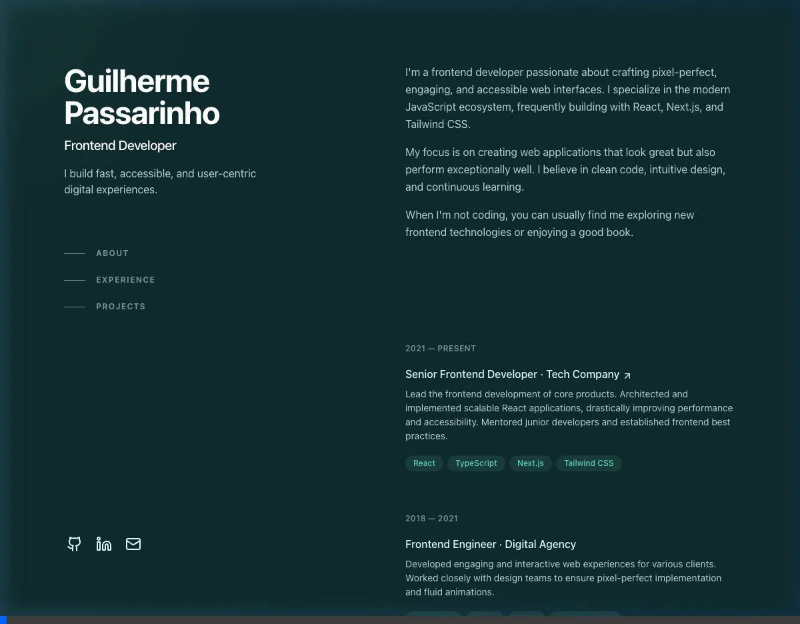
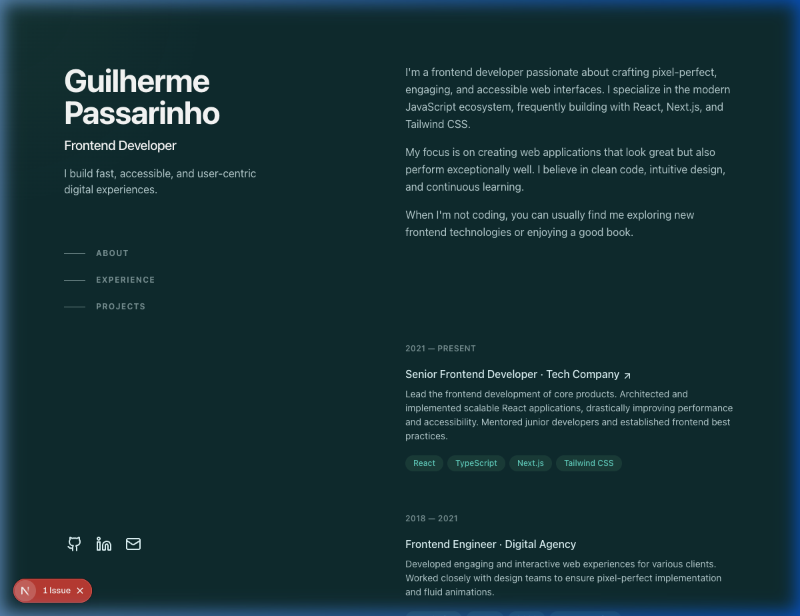
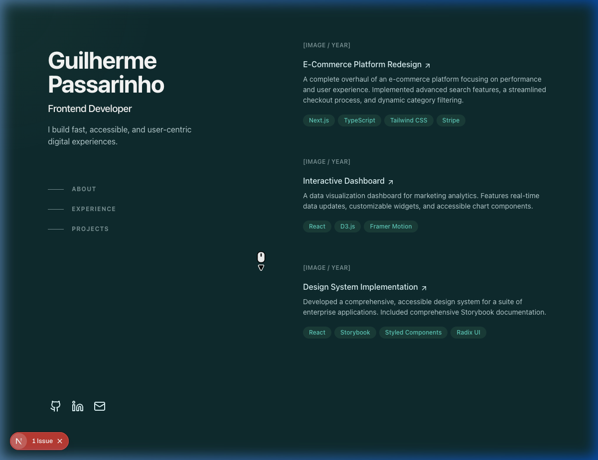
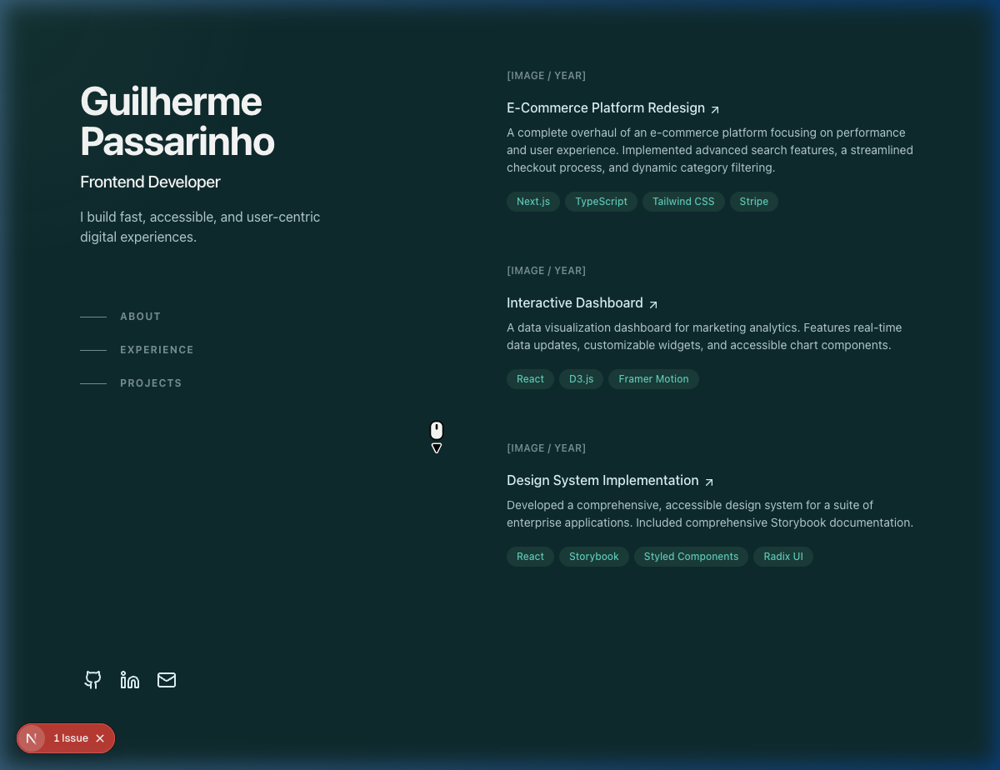

# Guilherme Passarinho - Portfolio

A modern, interactive portfolio website built to showcase my experience, projects, and skills as a Frontend Developer.

## 🚀 Tech Stack

- **Framework**: [Next.js 15](https://nextjs.org/) (App Router)
- **Language**: [TypeScript](https://www.typescriptlang.org/)
- **Styling**: [Tailwind CSS v4](https://tailwindcss.com/)
- **Animations**: [Framer Motion](https://www.framer.com/motion/)
- **Icons**: [Lucide React](https://lucide.dev/)

## 📁 Project Structure

The project directory is structured as follows:

```text
new-portfolio/
├── public/                 # Static assets
│   └── screenshots/        # Project preview images and video
├── src/
│   ├── app/                # Next.js App Router (Pages, Layout, Globals)
│   ├── components/         # React components
│   │   ├── layout/         # Structural layout components (e.g. Spotlight)
│   │   ├── sections/       # Main page sections (Hero, About, Experience, Projects)
│   │   └── ui/             # Smaller, reusable UI elements
│   ├── content/            # Static content data (Experience, Projects info)
│   ├── lib/                # Utility functions (e.g. cn)
│   └── types/              # TypeScript type definitions
```

## 📸 Previews

### Video Overview


### Hero Section


### Experience & Projects Sections


### Bottom Section


## 🛠️ Getting Started

First, install the dependencies:

```bash
npm install
# or
yarn install
# or
pnpm install
```

Then, run the development server:

```bash
npm run dev
# or
yarn dev
# or
pnpm dev
```

Open [http://localhost:3000](http://localhost:3000) with your browser to see the result.
